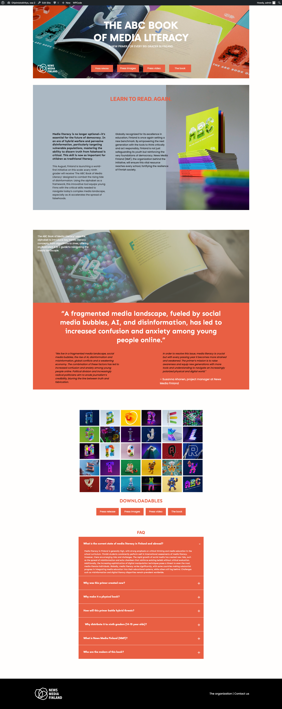

# Ohjelmistokehitys – Osa 2

WordPress Practice Website

This project is a WordPress practice site created as a study exercise.  
The page is loosely modeled after https://abcsofmedia.com/ and runs in a local development environment at:  
**http://ohjelmistokehitys-osa-2.local/**

# My Flex WordPress Page

This is my practice WordPress page based on the ABC of Media model.

## 📌 Purpose of the Project

The main goals were to:

- Practice working with the WordPress theme structure
- Recreate a custom version of a single-page layout inspired by a reference site
- Learn how to navigate and modify the `wp-content/themes` folder
- Build page sections, add images, manage layout, and adjust typography
- Practice using the WordPress block editor and Full Site Editing tools

## 📁 File Structure (Theme: _fleks_)

All project-related files are located in:
wp-content/
└── themes/
└── fleks/

Key files included in the theme:

- **style.css** — theme stylesheet and WordPress theme metadata
- **index.php** — main template file
- **templates/** — page templates
- **parts/** — reusable page sections
- **patterns/** — WordPress Block Patterns
- **theme.json** — color palette, typography, and global theme settings
- **screenshot.jpg** — thumbnail preview of the theme
- **functions.php** — asset registration and theme configuration

## 🔧 Technical Details

- The theme uses the modern WordPress Full Site Editing (FSE) structure.
- Developed using a local WordPress installation (e.g., LocalWP).
- Content layout follows the structure of the model site (abcsofmedia.com), but adapted for learning purposes.
- Visual assets are placed inside the theme’s `assets/` directory (if used).

## 🧪 Development Environment

The site runs locally at:

**http://ohjelmistokehitys-osa-2.local/**

Development tools and stack:

- LocalWP or similar WordPress environment
- PHP + MySQL
- WordPress 6.x

## 📄 Usage Instructions

1. Copy the theme into:  
   `wp-content/themes/fleks/`
2. Activate the theme in the WordPress Dashboard under:  
   **Appearance → Themes**
3. Open the homepage at:  
   **http://ohjelmistokehitys-osa-2.local/**

## 📚 Notes

- This is a practice project intended for learning only, not production use.
- The design and content have been simplified to focus on understanding WordPress theme structure and file organization.

---

## Contact

Portfolio: [Live Demo](https://portfoliosilvana.netlify.app/)

GitHub [1967cooder](https://github.com/1967cooder/)

LinkedIn: https://www.linkedin.com/in/silvanalindholm

Email: silvanalindholm@hotmail.com

Frontend Mentor - [@1967cooder
](https://www.frontendmentor.io/profile/1967cooder)
